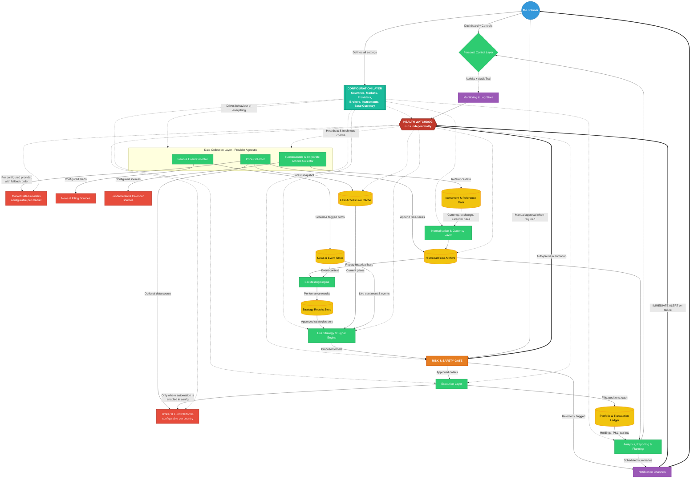

# StaySteady
## Detailed Requirements — Personal Multi-Market Investment & Backtesting Platform
 
## 1. Revised Project Overview
 
- Project name: StaySteady
- Name rationale:
  - Reflects the core philosophy — patient, disciplined investing over fast reactive trading
  - Doubles as a description of the safety layer, which exists to keep decisions steady when markets are not
  - Checked against existing finance and fintech products; no conflicting use found in this space
- Owner and primary user: a single individual (myself), not a public SaaS product
- Purpose of the system:
  - Track investments across multiple countries and multiple instrument types in one place
  - Build and keep a permanent historical price archive
  - Test investment strategies against past data before risking real money
  - Automate buy/sell decisions and order placement where it is safe and legal to do so
  - Collect and analyse market news, announcements and events as they happen
  - Produce reports and forward-looking plans for my own decision-making
- Design philosophy:
  - Configuration over code — adding a market, provider, broker or instrument type must not require rebuilding the system
  - Correctness and safety over speed of delivery — this system touches real money
  - Everything automated must first be provable in simulation
  - Nothing goes live-automatic until it has been run in observe-only mode for a meaningful period
  - The system must tell me when it is broken, loudly and immediately
## 2. What Changes From The Earlier Plan
 
- Multi-user accounts, registration and shared-tracking-across-users logic: no longer needed
- Login/identity still needed, but only to protect my own system from outside access
- Efficiency focus shifts from "avoid duplicate calls across many users" to "stay inside data provider rate limits and cost budgets"
- Everything market-specific becomes configurable rather than built-in
- Biggest addition: the system can now place real orders, which introduces a whole new safety and risk layer
- Second addition: multi-country support, which introduces currency, timezone, trading calendar, and tax complexity
- Third addition: news and event intelligence as a first-class feature, not an afterthought
- Fourth addition: a dedicated health watchdog that monitors the system itself and alerts me instantly on any failure
- Historical data is no longer a "future value" side-effect — it is now a core dependency for backtesting
## 3. Core Capability Pillars
 
- Pillar 0 — Configuration Layer: everything market, provider, broker and instrument specific is defined as settings, not code
- Pillar 1 — Data Foundation: continuously collect and store prices, fundamentals, news and events
- Pillar 2 — Research & Backtesting: replay history to evaluate whether a strategy actually works
- Pillar 3 — Live Signals: apply proven strategies to current market conditions
- Pillar 4 — Execution & Automation: act on signals, with hard safety limits
- Pillar 5 — Health & Monitoring: know instantly when any part of the system stops working
- Pillar 6 — Reporting & Planning: goal setting, allocation targets, rebalancing and tax awareness
## 4. Enhanced System Architecture
 

 
## 5. Configuration-Driven Design (Core Principle)
 
- Nothing market-specific, provider-specific or broker-specific is fixed inside the system's logic
- Everything below is defined as settings that I can add, change, enable or disable without rebuilding anything:
  - Countries and markets
  - Data providers and their credentials
  - News and event sources
  - Brokers and investment platforms
  - Instrument types and whether each one is automated
  - Base reporting currency
  - Risk limits and safety thresholds
  - Strategies and their parameters
  - Alert rules and delivery channels
- Every configured item carries a common set of controls:
  - An on/off switch that takes effect without restarting the whole system
  - A priority or fallback order where more than one option exists
  - A reference to its stored credentials, never the credentials themselves
  - Capability flags declaring what it can and cannot do
  - A health-check method so the watchdog knows how to test it
- Capability flags are respected absolutely — if a market, instrument or broker is not flagged as automation-capable, the system will never attempt to trade it automatically, regardless of what a strategy requests
- Configuration safety:
  - New or changed configuration must pass a completeness and validity check before it can be activated
  - Anything newly configured starts in simulation mode by default, never live
  - All configuration changes are versioned, with who/when/what recorded and the ability to roll back
  - Changes affecting money movement or risk limits require an extra confirmation step
## 6. Country & Market Configuration
 
- Each country or market is defined as its own configurable entry
- Settings held per market:
  - Market identity and the country it belongs to
  - Local trading currency
  - Local timezone
  - Regular trading hours, plus pre-open and post-close sessions if applicable
  - Weekend definition and full holiday calendar, including half-days
  - Settlement period before funds or units become usable
  - Fee, charge and duty model used for cost calculations
  - Tax rules, including holding-period thresholds that change treatment
  - Which instrument types are permitted in this market
  - Whether automated order placement is permitted here at all
  - Any local restrictions to enforce, such as limits on short selling or intraday leverage
  - Which data providers and brokers are linked to this market
- Adding a new country must be a configuration exercise only — no logic changes anywhere in the system
- A market can be disabled without deleting its history, so past data and past results remain intact
## 7. Data Provider Configuration
 
- Each data source is a separately configurable entry, whether it supplies prices, news, fundamentals or exchange rates
- Settings held per provider:
  - Which markets, instrument types and data categories it covers
  - Which time granularities it can supply
  - How far back its history goes
  - Request limits per minute, per day and per month
  - Cost per request or subscription tier, for budget tracking
  - Priority rank among providers covering the same data
  - Credential reference
  - Health-check method and expected response
  - Data freshness expectation, so staleness can be detected
- Multi-provider behaviour:
  - More than one provider can cover the same market, ranked by preference
  - If the preferred provider fails or hits its limit, the next one is used automatically
  - Failover events are always notified, never silent
  - Where two providers disagree materially on a price, flag it rather than silently picking one
- Budget and limit controls:
  - Track usage against each provider's limits continuously
  - Warn before a limit is reached, not after
  - Optionally reduce collection frequency instead of stopping entirely when approaching a limit
## 8. Broker & Platform Configuration
 
- Each broker, fund platform or investment account is a separately configurable entry
- Settings held per broker:
  - Which country and markets it operates in
  - Which instrument types it supports
  - Account currency
  - Whether it can be used as a data source in addition to execution
  - Whether programmatic order placement is supported at all
  - Which order types it supports
  - Whether it offers a simulation or practice environment
  - Its own fee and charge structure
  - Credential reference, with separate entries for simulation and live
  - Health-check method and connection expectations
  - Rate limits on order and query actions
- Per-broker automation control:
  - Automation can be enabled or disabled independently for each broker
  - Automation can be enabled for some instrument types on a broker and not others
  - Any broker not flagged as automation-capable is used for tracking and manual recording only
- Reconciliation requirement:
  - Positions, cash and transactions recorded in the system must be regularly compared against each broker's actual records
  - Any mismatch raises an immediate alert and pauses automation for that broker
## 9. Instrument Type Configuration
 
- Instrument types available to configure:
  - Intraday / day trading positions
  - Short-term / swing positions held days to weeks
  - Long-term holdings held months to years
  - Mutual funds and index funds, including recurring contributions
  - Exchange traded funds
  - IPOs and new listings
  - Bonds and fixed-income instruments
  - Commodities and precious metals
  - Currency pairs
  - Derivatives such as options and futures — higher risk, later phase
  - Digital assets — only where the configured market allows it
- Settings held per instrument type:
  - Whether it is enabled at all
  - Whether automation is permitted for it, independently of other types
  - Which markets it applies to
  - Price granularity required for it
  - Minimum investment amount and lot or unit restrictions
  - Settlement delay before it becomes tradeable or redeemable again
  - Holding-period thresholds relevant to tax
  - Whether it requires a manual action step that cannot be automated
- The automation permission is deliberately layered — an action only proceeds if the market, the broker, the instrument type and the strategy all permit it
- Instrument types that cannot be automated must still be fully trackable, with manual transactions recorded as first-class entries
## 10. Currency & Reporting Configuration
 
- A base reporting currency is configurable and can be changed later
- When the base currency is changed:
  - All historical reporting is recalculated using the stored historical exchange rates for the correct dates
  - Past reports remain reproducible in the currency they were originally produced in
- Every price, transaction, fee and payout is always stored in the currency it actually occurred in
- Exchange rates are collected and archived historically, treated as a data source with its own provider configuration
- Reporting requirements:
  - View results in the base currency, in any local currency, or side by side
  - Separate investment return from currency movement effect, since currency alone can change the outcome
  - Configurable currency conversion cost assumptions, applied consistently in both backtests and live reporting
## 11. Health Monitoring & Immediate Alerting Service
 
- Built as an independent watchdog that runs separately from the main system, so it survives when the main system fails
- What it monitors:
  - Each data collector — is it running and completing on schedule
  - Each configured data provider — is it reachable, responding, and within limits
  - Each configured broker connection — is it authenticated and responsive
  - Data freshness — is new price data actually arriving, or has it silently frozen
  - The live cache and each database — reachable, responsive, and growing as expected
  - The strategy engine — is it evaluating on schedule
  - The execution layer — are orders being confirmed, are there stuck or unconfirmed orders
  - Scheduled jobs — did they run, did they finish, did they take abnormally long
  - Storage capacity and system resources
  - The notification channels themselves — an alert system that cannot alert is worse than none
  - Its own liveness, through a dead-man's-switch that notifies me if the watchdog itself stops reporting
- Detection methods:
  - Regular heartbeat from every component, with a missed-heartbeat threshold
  - Direct availability checks against each configured external service
  - Freshness checks comparing the newest stored data against expected arrival times
  - Silence detection — a component that stops quietly is treated as failed, not as idle
  - Anomaly detection on volumes and timings that deviate sharply from normal
- Severity tiers and response:
  - Critical: anything affecting money or order placement — notify immediately and pause all automation
  - High: data collection stopped, provider or broker unreachable, database unavailable — notify immediately, attempt failover, pause affected strategies
  - Medium: degraded performance, approaching a provider limit, single failed run that retried successfully — notify in the next digest
  - Low: informational, recorded only
- Immediate notification requirements:
  - Critical and high alerts are delivered instantly, through at least two independent channels
  - At least one channel must not depend on the same infrastructure as the failing system
  - Alerts state clearly what failed, when, what it affects, what the system already did about it, and what I need to do
  - Repeat alerts are grouped rather than flooding, but suppression is time-limited so nothing is forgotten
  - Escalate with a louder or alternate channel if a critical alert goes unacknowledged
- Automatic protective actions on failure:
  - Pause automated trading when price data goes stale or a broker connection is lost
  - Fail over to the next configured provider where one exists
  - Retry with sensible backoff for transient failures, but never blind-retry an order that may have already been placed
  - Refuse to resume automation automatically after a critical failure — resumption must be a deliberate act by me
- Visibility and record keeping:
  - A live status view showing every configured component and its current state
  - Uptime and reliability history per component and per configured provider or broker
  - An incident record for every failure, with duration, cause and resolution
  - Reliability statistics feeding back into provider and broker priority decisions
- The alerting path itself must be tested on a regular schedule, so I know it still works before I actually need it
## 12. Data Foundation Requirements
 
- Price history collected at multiple granularities, driven by what each configured instrument type requires:
  - Fine-grained intraday bars for day-trading strategy testing
  - Daily bars for swing and positional strategies
  - Long-range daily and weekly history for long-term and fund strategies
- Historical archive requirements:
  - Never overwrite history — corrections are recorded as amendments, not silent edits
  - Store enough detail per bar to reconstruct opening, high, low, closing values and traded volume
  - Backfill history for any newly configured instrument, as far back as the provider allows
- Corporate action handling:
  - Splits, bonus issues, mergers and name changes must retroactively adjust historical prices
  - Dividends and payouts recorded separately so total return is calculated correctly
  - Getting this wrong silently produces wrong backtest results
- Data quality controls:
  - Detect and flag missing bars, frozen prices, obviously wrong values and duplicate records
  - Cross-check against a secondary configured provider where one is available
  - Mark any data point that was estimated or filled in, so backtests can exclude it
  - Every quality failure is reported to the health watchdog, not just logged
## 13. News, Events & Sentiment Intelligence
 
- Sources are configurable per country and per market, since relevant outlets differ by region
- Source categories to support:
  - General and financial news outlets
  - Official exchange announcements and regulatory filings
  - Company earnings releases and investor communications
  - Economic calendars covering interest rates, inflation and employment data
  - Corporate action notices and new listing announcements
- Processing steps:
  - Link every item to the specific instruments, markets and countries it affects
  - Classify by type, such as earnings, regulatory, management change, macroeconomic or unconfirmed report
  - Score sentiment with a confidence level
  - Rank by likely importance so noise does not drown out material news
  - Remove duplicates where the same story is republished across many outlets
  - Handle multiple languages where target countries require it
- Usage within the system:
  - Optional input into strategy decision-making, enabled per strategy
  - Trigger alerts for instruments I already hold
  - Provide context alongside price charts when reviewing a position
  - Automatically restrict or pause automated trading around configured high-impact scheduled events
- Limitation to design around:
  - Sentiment scoring aids judgement, it is not a reliable standalone trading signal
  - Any strategy leaning heavily on news sentiment must be tested with extra scepticism, including on data it was never tuned against
## 14. Backtesting Engine
 
- Purpose: replay historical market conditions to estimate how a strategy would have performed
- Must work across every configured market and instrument type, using that market's own configured rules
- Core requirements:
  - Simulate decisions using only information available at that moment in time
  - No access to future data at any point in the simulation
  - Support multiple time granularities, matched to the strategy type being tested
- Realism requirements — these separate a useful backtest from a misleading one:
  - Apply the configured fees, taxes and charges for the relevant market and broker
  - Model the gap between expected price and price actually achieved
  - Model the possibility that orders fill partially or not at all
  - Respect configured market hours, holidays and settlement delays
  - Respect configured minimum investment sizes and lot restrictions
  - Apply configured currency conversion costs on cross-border trades
- Output metrics per test:
  - Total and annualised return
  - Comparison against a benchmark configured for that market
  - Largest peak-to-trough decline and recovery duration
  - Volatility and risk-adjusted return measures
  - Win rate, average gain per winner, average loss per loser
  - Total number of trades and total costs paid
  - Breakdown by year, by market, by instrument type and by currency
- Validation features:
  - Test on one period, verify on a separate period the strategy never saw
  - Run the same strategy across multiple configured markets to see whether results hold generally
  - Vary strategy settings slightly to check robustness versus lucky fit
  - Flag when results depend on a small number of outlier trades
- Every run saved with its exact settings, data range, configuration snapshot and results, so past conclusions can be re-examined later
## 15. Strategy & Signal Engine
 
- Strategies are configurable definitions, adjustable without rewriting system logic
- Each strategy definition includes:
  - Which configured markets and instrument types it applies to
  - What conditions trigger a buy, a sell, or doing nothing
  - How much capital it may use
  - Expected holding duration
  - Conditions that force an exit regardless of anything else
  - Whether news and event inputs are used
- Strategy lifecycle stages, in strict order:
  - Draft — being designed, no live use
  - Backtested — has historical results, still no live use
  - Observation — runs live but only records what it would have done, places no orders
  - Semi-automatic — generates orders requiring my explicit approval
  - Fully automatic — places orders within pre-set limits without per-order approval
- A strategy advances a stage only by deliberate action, never automatically
- Multiple strategies may run at once, with conflict rules:
  - Define what happens when one strategy wants to buy while another wants to sell the same instrument
  - Prevent multiple strategies from unknowingly building an oversized combined position
  - Enforce an overall capital ceiling across all strategies together
## 16. Automated Investment & Execution
 
- Supported actions, subject to configuration permitting each one:
  - Place, modify and cancel orders on connected trading accounts
  - Subscribe to and redeem from fund-type investments
  - Set up and manage recurring scheduled investments
  - Apply for new listings where the platform allows it
- Execution requirements:
  - Every automated action traceable back to the strategy and signal that caused it
  - Confirm that an order was accepted, not merely sent
  - Reconcile recorded positions against actual broker positions regularly, alerting on mismatch
  - Handle partial fills, rejections and timeouts explicitly, never assuming success
  - Never blind-retry an order — a failed send may have actually gone through
- Operating modes, always clearly displayed:
  - Simulation mode, no real money involved
  - Observation mode, real market, no orders
  - Manual approval mode
  - Full automation mode
- Instruments and markets configured as manual-only are still fully tracked, with manual actions recorded as proper transactions
## 17. Risk Management & Safety Controls
 
- A dedicated safety layer sits between strategy decisions and real order placement — nothing bypasses it
- All thresholds are configurable, and can be set globally, per market, per instrument type and per strategy
- Position-level limits:
  - Maximum money committed to any single instrument
  - Maximum money committed to any single sector, market or country
  - Maximum total money deployed at any one time
  - Mandatory cash reserve that cannot be invested
- Loss-limiting controls:
  - Predefined exit level for every position
  - Maximum acceptable loss per day, per week and per month
  - Automatic halt of all automated activity when a loss threshold is breached
- Activity limits:
  - Maximum number of orders per day, overall and per market
  - Minimum gap between repeated actions on the same instrument
  - Restriction or suspension of automation during configured high-impact events
- Emergency controls:
  - A single, always-accessible master switch that immediately stops all automation
  - A separate control to close all open positions if required
  - Automatic pause triggered by the health watchdog on stale data, provider failure, broker disconnection or unexpected restart
  - Automatic pause when actual results diverge sharply from strategy expectations
- Every safety intervention generates an immediate notification stating the reason
## 18. Portfolio Analytics, Reporting & Planning
 
- Consolidated view requirements:
  - Total portfolio value across all configured countries, currencies and instrument types
  - Breakdown by country, currency, sector, instrument type, broker and strategy
  - Realised versus unrealised gains
  - Separation of investment return from currency movement effect
  - Income received, such as dividends, interest and payouts, tracked separately
- Performance reporting:
  - Returns over standard periods and since inception
  - Comparison against benchmarks configured per market
  - Which strategies contribute and which drag
  - Live results compared against backtest expectations — divergence is an early warning sign
- Cost transparency:
  - Total fees, charges and currency conversion costs paid per period
  - Cost as a percentage of returns
  - Data provider spend tracked alongside trading costs
- Tax awareness:
  - Track individual purchase lots with dates, so holding periods are known
  - Flag positions approaching a configured holding-period threshold that changes tax treatment
  - Produce country-wise summaries suitable for tax filing preparation
  - The system organises information; it does not replace professional tax advice
- Planning features:
  - Define target allocation across asset types, countries and currencies
  - Show current drift from target and what trades would correct it
  - Track progress against personal goals with target amounts and dates
  - Schedule and monitor recurring contributions
  - Model what-if scenarios before committing capital
## 19. Alerts & Notifications
 
- Alert categories:
  - Critical: system component down, safety limit breached, automation halted, execution failure, account mismatch
  - Action needed: order awaiting approval, IPO window closing, rebalancing required, credential expiring
  - Informational: significant news on a holding, notable price movement, order filled
  - Scheduled: daily market summary, weekly performance digest, monthly full report
- Delivery requirements:
  - Multiple configurable channels, with at least two independent paths for critical alerts
  - Critical alerts delivered immediately, with escalation if unacknowledged
  - Non-urgent items batched into digests to avoid alert fatigue
  - Every alert states what happened, why, and what action is available
- Alert rules configurable per category, per market, per broker and per strategy
- Delivery channels are themselves monitored and tested on a schedule
## 20. Access & Security
 
- Single-owner access, treated as security-sensitive because the system can move real money
- Requirements:
  - Strong authentication, with a second verification factor for anything that can place orders or change limits or configuration
  - All credentials stored encrypted, never in plain readable form, never inside code or configuration files
  - Read-only credentials used wherever trading permission is not actually required
  - Separate credential sets for simulation and live, impossible to confuse
  - Credential expiry tracked, with advance warning before anything lapses
  - The system not exposed openly to the public internet unless properly protected
  - Complete, tamper-evident audit trail of every configuration change, approval and order
  - Regular encrypted backups of the historical archive, configuration and transaction ledger, with restoration tested rather than assumed
## 21. Deployment & Operations
 
- Scale expectation: personal use, single operator — infrastructure modest and cost-controlled
- The health watchdog should run with as few shared dependencies as possible, ideally outside the main system, so it can still report when everything else is down
- All components packaged so the whole system can be rebuilt from scratch predictably, including its configuration
- Clear separation between:
  - A local environment for development and experimentation
  - A simulation environment using live data but no real money
  - The live environment with real trading enabled
- Automated testing before any update reaches the live environment, with extra scrutiny on anything touching order placement, risk limits or configuration handling
- Updates must not be applied while markets are open and positions are active, unless it is an emergency fix
- Every significant system action logged with a shared tracking reference, so a full decision chain can be reconstructed from signal to order to fill
## 22. Suggested Build Order
 
- Stage 1 — Configuration and foundation:
  - Configuration layer first, since everything else depends on it
  - Instrument reference data, currency handling, trading calendars
  - Price collection and historical archive for one configured market and one instrument type
  - Basic portfolio ledger with manual entry of existing holdings
- Stage 2 — Health watchdog:
  - Build monitoring and immediate alerting early, before anything runs unattended
  - Prove that failures are actually detected and that alerts actually arrive
- Stage 3 — Visibility:
  - Dashboard showing current holdings and performance
  - Basic reporting and alerts
  - Add a second country and second instrument type purely through configuration, to prove the design holds
- Stage 4 — Research:
  - Backtesting engine with realistic cost and timing modelling
  - Strategy definition and results storage
  - Validation tooling to avoid fooling myself with good-looking results
- Stage 5 — News:
  - News and event collection, tagging and alerting
  - Event-aware restrictions on trading windows
- Stage 6 — Live signals:
  - Strategy engine running in observation mode only
  - Compare live signals against backtest expectations over a meaningful period
- Stage 7 — Controlled automation:
  - Risk and safety layer built and tested first
  - Manual-approval execution on small amounts
  - Full automation only after extended, verified, uneventful operation
- Stage 8 — Depth:
  - Additional markets, brokers, instrument types and strategies, all by configuration
  - Advanced planning, tax and scenario tooling
## 23. Key Risks To Stay Aware Of
 
- A backtest that looks excellent is more often a modelling error than a great strategy
- Strategies tuned until they fit past data perfectly usually fail on new data
- Ignoring costs, taxes and slippage turns losing strategies into apparently winning ones
- Data errors propagate silently into decisions and money
- Automation failures can be expensive and fast — safety limits must exist before automation does
- A flexible configuration layer creates its own risk: a wrong setting can do as much damage as a bug, which is why validation, versioning and simulation-by-default matter
- Broad market moves affect all holdings at once, so apparent diversification may be weaker than it looks
- Regulatory rules on automated trading and cross-border investing differ by country and change over time
- Personal risk: automation removes the pause for reflection, so deliberate human checkpoints are a feature, not a limitation
### Added during the session 37 review
 
- A system that models only what is traded through a broker measures the wrong denominator: allocation, concentration and goal progress computed on a fraction of net worth will be confidently wrong
- Acting through an automated system does not remove a personal obligation under an employer trading policy or a regulator's rules — the system must enforce those restrictions, not provide a route around them
- The security model that protects this system also locks out the people who would need it if I were unavailable; strong access control without a tested emergency route is a single point of failure for my dependants
- My own behaviour during a sharp fall or a long rally is a larger long-run risk than any single strategy failing, and friction on manual action is the only practical guard
- Nominal returns flatter reality over a multi-decade horizon; a plan that ignores inflation, costs and taxes will overstate progress in exactly the direction I want to believe
- A strategy with no defined way down keeps trading after it stops working, because promotion paths are usually built with more care than retirement criteria
- Concentration risk includes employment: salary, employer equity and any correlated holdings are one exposure, not three
- The failure of a broker or custodian is low-probability and high-severity, and is not the same risk as a broker being temporarily unreachable
- Tax rules, remittance limits and disclosure obligations change; anything hardcoded becomes silently wrong at a date nobody notices
## 24. Remaining Open Questions
 
- Which market will be configured first, to prove the design before adding more?
- Which two independent channels will carry critical alerts, and will at least one work if the main system's host is down?
- What is the maximum amount of capital automation will ever be permitted to control?
- What is the realistic monthly budget for market and news data, and does that constrain the granularity available?
- How far back does the historical archive need to go for the strategies being considered?
- How much time per week is available to monitor and maintain the system once it is live?
- What is the fallback plan if the system is unavailable while positions are open?
- How quickly do I need to be alerted — seconds, or is a few minutes acceptable for each failure type?
### Added during the session 37 requirements review
 
- Which assets sit outside the brokers (provident fund, pension, deposits, gold, property, insurance-linked savings), and should the platform hold the complete picture or only the traded part?
- Am I subject to an employer trading policy — restricted lists, blackout windows, pre-clearance or minimum holding periods? This changes what the system is allowed to do.
- Who needs to reach this information if I cannot, and how would they do it today?
- Is this system the record of truth for my holdings, or is the broker, with this system as a view over it?
- What is the emergency reserve, in months of expenses, and is it held outside the invested capital?
- Will there be a withdrawal phase to model, or is this accumulation only for the foreseeable future?
- Which tax year does reporting follow, and which country am I tax resident in for the whole period being reported?
- At what total portfolio value would I want automation reduced or stopped rather than expanded?
---
 
# Part II — Requirements Added In The Session 37 Review
 
> Sections 25 to 34 were added on 2026-09-16 at the owner's request, after reviewing the original
> requirements against the stated purpose: this platform is for a single person's **entire**
> investment future, not a trading side-project.
>
> The original 24 sections describe a technically sound trading and monitoring system. What follows
> covers what that system still needs in order to be trusted with someone's whole financial life.
> Nothing above was changed or removed.
>
> **Tax, regulatory and compliance rules below are expressed as concepts the system must be able to
> represent, never as fixed rates or thresholds.** Consistent with Pillar 0, every rate, limit,
> holding period and date is configuration, verified with a qualified professional and versioned
> when it changes. The system organises information; it does not give tax, legal or financial advice.
 
## 25. Complete Net Worth — Assets Held Outside The Brokers
 
The original requirements model only what is traded through a configured broker. For a single-owner
platform intended to cover a whole financial future, that is usually a minority of net worth, and
every allocation target, goal projection and concentration limit computed without the rest is wrong.
 
- Record assets that are held but never traded through this system, at minimum:
  - Retirement and statutory savings — provident fund, pension accounts, government savings schemes
  - Cash and deposits — bank balances, term deposits, recurring deposits, with maturity dates
  - Physical and quasi-physical assets — gold, bullion, sovereign gold instruments
  - Property — with purchase cost, an occasional manual valuation, and any loan secured against it
  - Insurance-linked savings, where a policy has a maturity or surrender value
  - Employer equity — vested and unvested, with vesting schedule and any lock-in
  - Liabilities — loans and outstanding credit, since net worth is assets minus debts
- These are manual-entry, low-frequency records, not market-fed:
  - Each carries the date it was last updated, and is visibly marked stale after a configurable age
  - Valuations may be manual, periodic, or formula-based (for example a deposit accruing at a known rate)
  - No automation ever acts on these — they are read-only for the strategy and execution layers
- Once recorded, they participate in:
  - Total net worth, and the split between market-exposed and non-market assets
  - Allocation targets and drift, so the picture reflects reality rather than the traded slice
  - Goal progress and funding projections
  - Concentration limits, so exposure is measured against total wealth, not just the brokerage balance
  - Liquidity classification — what could be converted to cash quickly, and what could not
- Concentration must be measurable against total wealth including employment:
  - Employer equity plus salary dependence is a single concentrated exposure and must be shown as one
  - Warn when any single issuer, sector or asset class exceeds a configured share of total net worth
## 26. Tax Requirements In Depth
 
The original requirements cover purchase lots, holding-period thresholds and country-wise summaries.
That is the foundation, but the parts that actually cause loss — missed disclosures, unclaimed
reliefs, unplanned instalments — are not yet represented.
 
- Tax rules are configuration, per country of residence and per instrument type:
  - Distinct short-term and long-term treatment, each with its own configurable holding period and rate
  - Different rules per asset class, since equity, funds, debt, gold and property commonly differ
  - A configurable cost-basis rule per jurisdiction, with the method recorded on every disposal
  - Historical cost-basis protections where a regime changed on a known date, applied to assets acquired before it
  - Transaction-level taxes and duties captured as costs at the time they occur
- Gains, losses and reliefs:
  - Separate realised and unrealised gains by tax category, not just by instrument
  - Track losses available to offset gains, including how long each remains available and when it expires
  - Show the effect of an intended disposal before it happens — which category it falls in, what it offsets, what it costs
  - Flag positions approaching a holding-period boundary where waiting materially changes the outcome
- Income:
  - Dividends, interest and payouts classified by their own treatment, which often differs from capital gains
  - Tax withheld at source recorded per payment, per country, so it can be reclaimed or credited
  - Where a treaty reduces withholding, record whether the required declaration is in place and when it expires
- Cross-border obligations, where foreign assets are held:
  - Track any statutory annual disclosure of foreign assets, with the values and periods it requires
  - Track any cap on outward remittance per year, with spend to date and headroom remaining
  - Track relief for tax already paid abroad, and the evidence needed to claim it
  - Warn before a remittance would breach a configured annual limit
- Timing and filing:
  - Reporting periods follow the configured tax year, which is not necessarily the calendar year
  - Estimate periodic advance instalments where required, with due dates and a projected liability
  - Produce a year-end pack per jurisdiction: realised gains by category, income, taxes withheld,
    costs, losses carried in and out, and foreign holdings
  - Retain the underlying records for a configurable statutory period, exportable on demand
- The system prepares and organises. It never files, and never claims a figure is final.
## 27. Personal Regulatory & Employer Compliance
 
Absent entirely, and the highest-consequence gap in the document. A breach here is not a financial
loss — it is a career and legal exposure, and it is caused by a system acting on my behalf.
 
- Employer trading policy must be representable as configuration and enforced by the safety layer:
  - A restricted list of instruments I may not trade at all, maintained manually
  - Blackout windows during which I may not trade, recurring or ad hoc
  - A pre-clearance requirement: certain trades need recorded approval before they may be placed
  - A minimum holding period preventing short-term round trips where policy requires it
  - Personal disclosure obligations, with reminders before their deadlines
- Enforcement rules:
  - These checks sit in the same safety layer as risk limits, and nothing bypasses them
  - A restricted or blacked-out instrument is refused at signal stage, not at order stage, so it never reaches a broker
  - A refusal is recorded with its reason and is visible in the audit log
  - Restrictions apply identically to manual actions and automated ones — the system must not become the easy way around a policy
- Jurisdictional awareness:
  - Rules on automated trading and cross-border investing differ by country and change; treat them as configuration with a review date
  - Record a periodic prompt to re-check that the configured rules still match current policy and law
## 28. Continuity, Succession & Incapacity
 
The security requirements correctly make this system hard to get into. Nothing makes it possible to
get into when it matters most. A single-owner system holding a complete financial picture becomes a
single point of failure for the people who would need it.
 
- Emergency access:
  - A documented, tested way for a nominated person to reach the complete position record if I cannot
  - Access to information must be separable from the ability to trade — a nominee needs to see, not act
  - Stored so that it survives the loss of my devices, and does not depend on this system running
- Records that must exist outside the system:
  - Which brokers, banks and custodians hold what, and the account references
  - Where credentials and recovery material are kept, without the credentials themselves being in the document
  - Nominee and beneficiary registrations held at each institution, with the date each was last confirmed
  - A plain-language explanation of what is automated, how to stop it, and who to contact
- Automation must fail safe when I am absent:
  - A configurable inactivity threshold after which automation pauses rather than continues unattended
  - Escalating reminders before that pause, so it is never a surprise
  - Resumption is always a deliberate act, consistent with the existing watchdog rules
- Reviewed and re-tested on a fixed schedule, with the date of the last successful test recorded and visible
## 29. Behavioural Safeguards On My Own Decisions
 
The document already recognises that "automation removes the pause for reflection". The safety layer
implements that insight for machine decisions only. For a personal portfolio, the larger long-run
risk is my own behaviour during a drawdown or a rally, and nothing currently guards against it.
 
- Manual actions pass through the safety layer, not around it:
  - A manual order is checked against the same position, loss, activity and compliance limits as an automated one
  - Overriding a limit is possible but always deliberate, recorded, and shown with what the limit was protecting against
- Friction proportional to consequence:
  - A configurable cooling-off period between deciding and executing for trades above a configured size
  - A configurable daily cap on manual trades, separate from the automated cap
  - A confirmation that states the cost of the action — fees, taxes, realised gain or loss — before it is committed
- Pattern detection on my own activity, reported to me without judgement:
  - Unusual clustering of manual trades, particularly after a loss
  - Repeated overrides of the same limit
  - Trading concentrated in periods of high market volatility or immediately after significant news
  - Divergence between my stated allocation targets and what I actually do
- A decision journal:
  - Every manual trade and every override can carry a short stated reason, prompted at the time
  - Reasons are reviewable later alongside the outcome, so the record shows which reasoning worked
  - Optional by configuration, but on by default — this is the mechanism that makes the pause real
- Scheduled review rather than continuous watching:
  - A periodic review view designed to be the normal way I engage with the portfolio
  - Discourage the dashboard becoming something checked many times a day
## 30. Liquidity, Emergency Reserve & Withdrawal Phase
 
The existing "mandatory cash reserve that cannot be invested" is a trading control. It is not the
same as a life emergency fund, and the document models accumulation only.
 
- Emergency reserve:
  - Defined in months of living expenses, configurable, held outside investable capital
  - Tracked and reported separately from the trading cash reserve
  - Warn when it falls below target, and never allow automation to consume it
- Liquidity classification:
  - Every asset classified by how quickly it could become spendable cash, including settlement time
  - A view of what is reachable within days, weeks and months
  - Warn when upcoming known commitments exceed what can be liquidated in time
- Known future commitments:
  - Record expected outflows with dates and amounts
  - Show them against projected liquidity so a shortfall is visible in advance
- Withdrawal phase, when it applies:
  - Model a sustainable withdrawal rate against the portfolio and its assumptions
  - Plan the order in which assets would be drawn down, taking tax treatment and holding periods into account
  - Show the effect of poor returns early in a withdrawal period, since sequence matters more than average return
  - Model a partial withdrawal phase, where some income is drawn while contributions continue
## 31. Real Returns & Long-Horizon Planning
 
Every metric in the specification is nominal. Over the horizon this platform is meant to serve, that
systematically overstates progress.
 
- Inflation:
  - A configurable inflation assumption per country, with actual historical figures where available
  - Report returns and goal progress in both nominal and inflation-adjusted terms
  - Express long-dated goals in today's purchasing power, not just a future figure
- Projections:
  - Show a range of outcomes rather than a single line, with the assumptions stated on the view
  - Include contributions, costs, taxes and inflation in any projection, since excluding them flatters the result
  - Record the assumptions used with each saved projection so past projections remain interpretable
- Honesty controls:
  - Show what the same money would have done in a simple benchmark alternative, so the value of all this effort is measurable
  - Track total costs and taxes paid to date as a percentage of gross return
  - Report return since inception on a basis that accounts for the timing of contributions
## 32. Counterparty & Custodian Risk
 
The health watchdog monitors whether a broker is *reachable*. It does not consider what happens if a
broker or custodian *fails*, which for a personal portfolio is a low-probability, high-severity event.
 
- Exposure per counterparty:
  - Show assets held per broker, custodian and bank, as a share of total net worth
  - Warn when any single counterparty exceeds a configured share
  - Record what protection scheme, if any, applies per institution and up to what limit
- Independent verification:
  - Where the market provides a statement from the central depository or registrar independent of the broker, reconcile against it on a schedule
  - Treat a mismatch between broker records and the independent statement as critical, in the same tier as an account mismatch
- Continuity:
  - Record how holdings would be recovered or transferred if an institution became unavailable
  - Keep enough of an independent record — holdings, costs, lots — that my position is provable without the broker's system
  - Prefer that the ability to reconstruct my portfolio never depends on a single third party
## 33. Strategy Decay & Retirement
 
Strategies have lifecycle stages and a promotion path. There is no defined way down, so a strategy
that stops working can quietly keep trading.
 
- Retirement criteria defined before a strategy goes live, not after it disappoints:
  - Rolling performance thresholds over a configured window that trigger review
  - Maximum acceptable divergence from backtest expectation before automatic demotion
  - A maximum period without meeting expectations, after which the strategy is retired regardless
- Automatic demotion, not just alerting:
  - Breaching a review threshold moves a strategy to observation, reducing or removing its allocation
  - Demotion is recorded with the evidence that triggered it
  - Returning a strategy to live requires the same deliberate promotion path as the first time
- Portfolio-level awareness:
  - Detect when strategies that are supposed to be independent begin behaving alike, since apparent diversification then disappears
  - Track how much of total return depends on a single strategy
  - Record a regular review of whether each strategy's original reasoning still holds
## 34. Data Ownership, Export & Dormant Operation
 
Backups are specified. Portability and graceful neglect are not, and both matter for something
intended to run for decades.
 
- Export:
  - Complete export of holdings, lots, transactions, income, costs, configuration and history in open, documented formats
  - Export must be usable without this software, since its purpose is to outlive it
  - Available on demand and on a schedule, included in the backup set
- Longevity:
  - Prefer plain, documented storage formats over anything proprietary
  - Keep the historical archive separable from the application, so the data survives a rewrite
  - Record the meaning of stored fields, since a future reader will not remember the conventions
- Dormant operation:
  - A defined low-maintenance mode: monitoring, reconciliation, income recording and alerting continue while automation is paused
  - Safe to leave unattended for an extended period without silent failure or data loss
  - On return, a summary of what happened while I was away, rather than an undifferentiated backlog
- Cost control:
  - Track running cost per month against a configured budget, including data, hosting and broker charges
  - Report cost as a share of portfolio value, since a fixed cost becomes significant on a small portfolio
  - Warn when cost per month exceeds a configured threshold or grows unexpectedly
  
---
 
# Part III — Pre-Investment Research Requirements (Added In The Session 83 Review)
 
> Owner instruction, session 83: before committing money to an instrument I need the end-to-end
> picture of the company behind it — what it does, who owns and controls it, which group and parent
> it belongs to, how it earns, what it owes, and what is happening around it right now. Sections 12
> and 13 collect fundamentals and news at the data layer; nothing before this said what must be held
> and shown about the company itself. Sections 35–38 close that gap and are in scope.
 
## 35. Company & Instrument Research Record
 
One record per instrument, gathering everything known about the issuer behind it. Refreshed per
source on its own schedule, and every field carries its source, as-of date and staleness.
 
- Identity:
  - Legal name, trading symbol on each market where it is listed, ISIN and local identifiers
  - Country of incorporation, primary listing and any secondary listings, listing date
  - Headquarters, website, employee count, reporting currency, fiscal year end
- What the business does:
  - Plain description of the business, not a marketing summary
  - Revenue split by segment and by geography wherever the company reports it
  - Where relevant, the handful of customers, suppliers or products the business depends on
- Who runs it:
  - Chief executive and chair, with tenure, and any change in the last twelve months
  - Auditor, the date of the last opinion, and whether that opinion was qualified
- Applicability:
  - An instrument with no company behind it (commodity, currency pair, index fund, digital asset)
    says so explicitly; it never shows blank company fields as though data were missing
## 36. Classification, Corporate Structure & Ownership
 
Classification is not a label on a screen. Concentration limits, allocation targets, peer comparison
and strategy universes are all wrong or unavailable without it.
 
- Classification:
  - Two levels, sector then industry, in one scheme applied across every market
  - Where a provider supplies its own scheme, the mapping to it is retained rather than discarded
  - Instruments that cannot carry a company classification carry an asset-class classification instead
  - One classification serves every consumer: allocation, limits, screening, peer groups and reporting
- Corporate structure — the parent and the group:
  - Parent or holding company where the instrument is a subsidiary, with the share held
  - Business group or promoter group where one exists, since group identity crosses sectors
  - Material listed subsidiaries and associates, so the same underlying business is not counted once
    when it is really held twice
  - Cross-holdings between group companies, where a group event would hit several holdings at once
  - Group exposure measured and limited alongside sector exposure: four companies of one group is one bet
- Ownership:
  - Ownership pattern over time — promoter or founder, foreign institutional, domestic institutional, public
  - Shares pledged by the promoter, with the trend, since a rising pledge is a warning and not a statistic
  - Insider and promoter transactions where they are published
- Funds:
  - Exchange-traded and mutual funds look through to what they hold — top holdings, sector weights,
    the index tracked and assets under management
  - Exposure held through a fund counts towards sector and group exposure, not only the fund's own line
- Changes to classification, parent, group or ownership are recorded with the date they changed and
  never overwritten silently
## 37. Financial Statements & Derived Measures
 
- Statements as reported, not summarised into a handful of numbers:
  - Balance sheet, income statement and cash flow statement
  - At least five years of annual statements and eight quarters of interim statements
  - Balance sheet: total and current assets, cash and equivalents, total and current liabilities,
    total debt, shareholders' equity, shares outstanding
  - Income: revenue, gross profit, operating profit, EBITDA, net profit, earnings per share, tax
  - Cash flow: operating cash flow, capital expenditure, free cash flow, dividends paid, debt raised and repaid
  - Consolidated and standalone statements kept distinct where both are published; mixing them
    silently produces a wrong answer
- Every statement carries its reporting currency, fiscal period, period end date, whether it was
  audited, whether it restates an earlier figure, and **the date it was published**
  - The publication date is required, not optional. A backtest may only use figures that had been
    published by the simulated date. Without it, every rule built on fundamentals looks better than it was
- Derived measures, computed from the stored statements and never stored as an unexplained number:
  - Valuation: price to earnings, price to book, enterprise value to EBITDA, price to sales,
    dividend yield, payout ratio
  - Profitability: return on equity, return on capital employed, operating and net margin
  - Financial health: debt to equity, net debt to EBITDA, current ratio, interest coverage
  - Growth: revenue, profit and earnings per share over three and five years, and the latest quarter
    against the same quarter a year earlier
  - Cash quality: free cash flow against reported net profit
  - Each measure can show the inputs and the periods it was computed from
- Comparison is part of the requirement, not an extra:
  - Every measure shown against the instrument's own history
  - Every measure shown against the median of its industry peer group
  - A ratio with nothing to compare it against does not support a decision
- Warning flags, stated as observations with the evidence attached, never as advice:
  - Debt rising while profit falls; several years of negative free cash flow; payout above earnings
  - Promoter pledge rising; auditor qualification; repeated restatements
  - Receivables or inventory growing materially faster than revenue
- Out of scope, deliberately: analyst price targets, buy and sell ratings, and consensus estimates.
  Those are opinions, and this platform deals in reported facts. Revisit only if earnings-surprise
  tracking is added later, and then only as clearly labelled third-party estimates
- Where a measure does not apply to an instrument type, say so and why; never show zero or a blank
## 38. News, Events & Filings For One Instrument
 
Section 13 covers collection across the system. This section states what must reach the research
record of a single instrument, because news is decision context and not a separate hobby.
 
- Everything known to affect this instrument, on its record:
  - News linked to the instrument, newest first, with source, time, category, importance, and
    sentiment always shown with its confidence
  - News about the parent, the group and material listed subsidiaries, marked as reaching the
    instrument indirectly — a group event is still the owner's risk
  - News about the industry peer group, so a sector-wide move is not mistaken for a company event
  - Regulatory filings and exchange announcements
  - Corporate actions — dividends, splits, bonus issues, buybacks, rights issues, mergers, name
    changes — with those already effective separated from those announced but not yet effective
  - Management, auditor and credit-rating changes where published
- Scheduled ahead of time, not only after the fact:
  - Next earnings or results date, board meetings, ex-dividend and record dates
  - Index inclusion and exclusion, lock-in and offer expiry dates
  - Which of these fall inside a configured automation restriction window, and when the next
    restriction window for this instrument begins
- Every item links to the price chart at its time, so the reaction to it can be seen
- Anything rumoured or unconfirmed is labelled as such and never counted as a fact
 
### Data discipline for sections 35–38
 
- Every value carries its source and as-of date, and shows plainly when it is stale
- Where two configured providers disagree on a figure, both are shown with their sources rather than
  one being silently chosen
- Nothing in the research record is presented as advice, a recommendation or a target price
