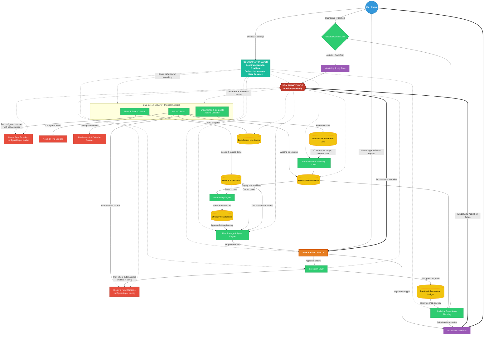

# StaySteady
## Detailed Requirements — Personal Multi-Market Investment & Backtesting Platform

## 1. Revised Project Overview

- Project name: StaySteady
- Name rationale:
  - Reflects the core philosophy — patient, disciplined investing over fast reactive trading
  - Doubles as a description of the safety layer, which exists to keep decisions steady when markets are not
  - Checked against existing finance and fintech products; no conflicting use found in this space
- Owner and primary user: a single individual (myself), not a public SaaS product
- Purpose of the system:
  - Track investments across multiple countries and multiple instrument types in one place
  - Build and keep a permanent historical price archive
  - Test investment strategies against past data before risking real money
  - Automate buy/sell decisions and order placement where it is safe and legal to do so
  - Collect and analyse market news, announcements and events as they happen
  - Produce reports and forward-looking plans for my own decision-making
- Design philosophy:
  - Configuration over code — adding a market, provider, broker or instrument type must not require rebuilding the system
  - Correctness and safety over speed of delivery — this system touches real money
  - Everything automated must first be provable in simulation
  - Nothing goes live-automatic until it has been run in observe-only mode for a meaningful period
  - The system must tell me when it is broken, loudly and immediately

## 2. What Changes From The Earlier Plan

- Multi-user accounts, registration and shared-tracking-across-users logic: no longer needed
- Login/identity still needed, but only to protect my own system from outside access
- Efficiency focus shifts from "avoid duplicate calls across many users" to "stay inside data provider rate limits and cost budgets"
- Everything market-specific becomes configurable rather than built-in
- Biggest addition: the system can now place real orders, which introduces a whole new safety and risk layer
- Second addition: multi-country support, which introduces currency, timezone, trading calendar, and tax complexity
- Third addition: news and event intelligence as a first-class feature, not an afterthought
- Fourth addition: a dedicated health watchdog that monitors the system itself and alerts me instantly on any failure
- Historical data is no longer a "future value" side-effect — it is now a core dependency for backtesting

## 3. Core Capability Pillars

- Pillar 0 — Configuration Layer: everything market, provider, broker and instrument specific is defined as settings, not code
- Pillar 1 — Data Foundation: continuously collect and store prices, fundamentals, news and events
- Pillar 2 — Research & Backtesting: replay history to evaluate whether a strategy actually works
- Pillar 3 — Live Signals: apply proven strategies to current market conditions
- Pillar 4 — Execution & Automation: act on signals, with hard safety limits
- Pillar 5 — Health & Monitoring: know instantly when any part of the system stops working
- Pillar 6 — Reporting & Planning: goal setting, allocation targets, rebalancing and tax awareness

## 4. Enhanced System Architecture

## 5. Configuration-Driven Design (Core Principle)

- Nothing market-specific, provider-specific or broker-specific is fixed inside the system's logic
- Everything below is defined as settings that I can add, change, enable or disable without rebuilding anything:
  - Countries and markets
  - Data providers and their credentials
  - News and event sources
  - Brokers and investment platforms
  - Instrument types and whether each one is automated
  - Base reporting currency
  - Risk limits and safety thresholds
  - Strategies and their parameters
  - Alert rules and delivery channels
- Every configured item carries a common set of controls:
  - An on/off switch that takes effect without restarting the whole system
  - A priority or fallback order where more than one option exists
  - A reference to its stored credentials, never the credentials themselves
  - Capability flags declaring what it can and cannot do
  - A health-check method so the watchdog knows how to test it
- Capability flags are respected absolutely — if a market, instrument or broker is not flagged as automation-capable, the system will never attempt to trade it automatically, regardless of what a strategy requests
- Configuration safety:
  - New or changed configuration must pass a completeness and validity check before it can be activated
  - Anything newly configured starts in simulation mode by default, never live
  - All configuration changes are versioned, with who/when/what recorded and the ability to roll back
  - Changes affecting money movement or risk limits require an extra confirmation step

## 6. Country & Market Configuration

- Each country or market is defined as its own configurable entry
- Settings held per market:
  - Market identity and the country it belongs to
  - Local trading currency
  - Local timezone
  - Regular trading hours, plus pre-open and post-close sessions if applicable
  - Weekend definition and full holiday calendar, including half-days
  - Settlement period before funds or units become usable
  - Fee, charge and duty model used for cost calculations
  - Tax rules, including holding-period thresholds that change treatment
  - Which instrument types are permitted in this market
  - Whether automated order placement is permitted here at all
  - Any local restrictions to enforce, such as limits on short selling or intraday leverage
  - Which data providers and brokers are linked to this market
- Adding a new country must be a configuration exercise only — no logic changes anywhere in the system
- A market can be disabled without deleting its history, so past data and past results remain intact

## 7. Data Provider Configuration

- Each data source is a separately configurable entry, whether it supplies prices, news, fundamentals or exchange rates
- Settings held per provider:
  - Which markets, instrument types and data categories it covers
  - Which time granularities it can supply
  - How far back its history goes
  - Request limits per minute, per day and per month
  - Cost per request or subscription tier, for budget tracking
  - Priority rank among providers covering the same data
  - Credential reference
  - Health-check method and expected response
  - Data freshness expectation, so staleness can be detected
- Multi-provider behaviour:
  - More than one provider can cover the same market, ranked by preference
  - If the preferred provider fails or hits its limit, the next one is used automatically
  - Failover events are always notified, never silent
  - Where two providers disagree materially on a price, flag it rather than silently picking one
- Budget and limit controls:
  - Track usage against each provider's limits continuously
  - Warn before a limit is reached, not after
  - Optionally reduce collection frequency instead of stopping entirely when approaching a limit

## 8. Broker & Platform Configuration

- Each broker, fund platform or investment account is a separately configurable entry
- Settings held per broker:
  - Which country and markets it operates in
  - Which instrument types it supports
  - Account currency
  - Whether it can be used as a data source in addition to execution
  - Whether programmatic order placement is supported at all
  - Which order types it supports
  - Whether it offers a simulation or practice environment
  - Its own fee and charge structure
  - Credential reference, with separate entries for simulation and live
  - Health-check method and connection expectations
  - Rate limits on order and query actions
- Per-broker automation control:
  - Automation can be enabled or disabled independently for each broker
  - Automation can be enabled for some instrument types on a broker and not others
  - Any broker not flagged as automation-capable is used for tracking and manual recording only
- Reconciliation requirement:
  - Positions, cash and transactions recorded in the system must be regularly compared against each broker's actual records
  - Any mismatch raises an immediate alert and pauses automation for that broker

## 9. Instrument Type Configuration

- Instrument types available to configure:
  - Intraday / day trading positions
  - Short-term / swing positions held days to weeks
  - Long-term holdings held months to years
  - Mutual funds and index funds, including recurring contributions
  - Exchange traded funds
  - IPOs and new listings
  - Bonds and fixed-income instruments
  - Commodities and precious metals
  - Currency pairs
  - Derivatives such as options and futures — higher risk, later phase
  - Digital assets — only where the configured market allows it
- Settings held per instrument type:
  - Whether it is enabled at all
  - Whether automation is permitted for it, independently of other types
  - Which markets it applies to
  - Price granularity required for it
  - Minimum investment amount and lot or unit restrictions
  - Settlement delay before it becomes tradeable or redeemable again
  - Holding-period thresholds relevant to tax
  - Whether it requires a manual action step that cannot be automated
- The automation permission is deliberately layered — an action only proceeds if the market, the broker, the instrument type and the strategy all permit it
- Instrument types that cannot be automated must still be fully trackable, with manual transactions recorded as first-class entries

## 10. Currency & Reporting Configuration

- A base reporting currency is configurable and can be changed later
- When the base currency is changed:
  - All historical reporting is recalculated using the stored historical exchange rates for the correct dates
  - Past reports remain reproducible in the currency they were originally produced in
- Every price, transaction, fee and payout is always stored in the currency it actually occurred in
- Exchange rates are collected and archived historically, treated as a data source with its own provider configuration
- Reporting requirements:
  - View results in the base currency, in any local currency, or side by side
  - Separate investment return from currency movement effect, since currency alone can change the outcome
  - Configurable currency conversion cost assumptions, applied consistently in both backtests and live reporting

## 11. Health Monitoring & Immediate Alerting Service

- Built as an independent watchdog that runs separately from the main system, so it survives when the main system fails
- What it monitors:
  - Each data collector — is it running and completing on schedule
  - Each configured data provider — is it reachable, responding, and within limits
  - Each configured broker connection — is it authenticated and responsive
  - Data freshness — is new price data actually arriving, or has it silently frozen
  - The live cache and each database — reachable, responsive, and growing as expected
  - The strategy engine — is it evaluating on schedule
  - The execution layer — are orders being confirmed, are there stuck or unconfirmed orders
  - Scheduled jobs — did they run, did they finish, did they take abnormally long
  - Storage capacity and system resources
  - The notification channels themselves — an alert system that cannot alert is worse than none
  - Its own liveness, through a dead-man's-switch that notifies me if the watchdog itself stops reporting
- Detection methods:
  - Regular heartbeat from every component, with a missed-heartbeat threshold
  - Direct availability checks against each configured external service
  - Freshness checks comparing the newest stored data against expected arrival times
  - Silence detection — a component that stops quietly is treated as failed, not as idle
  - Anomaly detection on volumes and timings that deviate sharply from normal
- Severity tiers and response:
  - Critical: anything affecting money or order placement — notify immediately and pause all automation
  - High: data collection stopped, provider or broker unreachable, database unavailable — notify immediately, attempt failover, pause affected strategies
  - Medium: degraded performance, approaching a provider limit, single failed run that retried successfully — notify in the next digest
  - Low: informational, recorded only
- Immediate notification requirements:
  - Critical and high alerts are delivered instantly, through at least two independent channels
  - At least one channel must not depend on the same infrastructure as the failing system
  - Alerts state clearly what failed, when, what it affects, what the system already did about it, and what I need to do
  - Repeat alerts are grouped rather than flooding, but suppression is time-limited so nothing is forgotten
  - Escalate with a louder or alternate channel if a critical alert goes unacknowledged
- Automatic protective actions on failure:
  - Pause automated trading when price data goes stale or a broker connection is lost
  - Fail over to the next configured provider where one exists
  - Retry with sensible backoff for transient failures, but never blind-retry an order that may have already been placed
  - Refuse to resume automation automatically after a critical failure — resumption must be a deliberate act by me
- Visibility and record keeping:
  - A live status view showing every configured component and its current state
  - Uptime and reliability history per component and per configured provider or broker
  - An incident record for every failure, with duration, cause and resolution
  - Reliability statistics feeding back into provider and broker priority decisions
- The alerting path itself must be tested on a regular schedule, so I know it still works before I actually need it

## 12. Data Foundation Requirements

- Price history collected at multiple granularities, driven by what each configured instrument type requires:
  - Fine-grained intraday bars for day-trading strategy testing
  - Daily bars for swing and positional strategies
  - Long-range daily and weekly history for long-term and fund strategies
- Historical archive requirements:
  - Never overwrite history — corrections are recorded as amendments, not silent edits
  - Store enough detail per bar to reconstruct opening, high, low, closing values and traded volume
  - Backfill history for any newly configured instrument, as far back as the provider allows
- Corporate action handling:
  - Splits, bonus issues, mergers and name changes must retroactively adjust historical prices
  - Dividends and payouts recorded separately so total return is calculated correctly
  - Getting this wrong silently produces wrong backtest results
- Data quality controls:
  - Detect and flag missing bars, frozen prices, obviously wrong values and duplicate records
  - Cross-check against a secondary configured provider where one is available
  - Mark any data point that was estimated or filled in, so backtests can exclude it
  - Every quality failure is reported to the health watchdog, not just logged

## 13. News, Events & Sentiment Intelligence

- Sources are configurable per country and per market, since relevant outlets differ by region
- Source categories to support:
  - General and financial news outlets
  - Official exchange announcements and regulatory filings
  - Company earnings releases and investor communications
  - Economic calendars covering interest rates, inflation and employment data
  - Corporate action notices and new listing announcements
- Processing steps:
  - Link every item to the specific instruments, markets and countries it affects
  - Classify by type, such as earnings, regulatory, management change, macroeconomic or unconfirmed report
  - Score sentiment with a confidence level
  - Rank by likely importance so noise does not drown out material news
  - Remove duplicates where the same story is republished across many outlets
  - Handle multiple languages where target countries require it
- Usage within the system:
  - Optional input into strategy decision-making, enabled per strategy
  - Trigger alerts for instruments I already hold
  - Provide context alongside price charts when reviewing a position
  - Automatically restrict or pause automated trading around configured high-impact scheduled events
- Limitation to design around:
  - Sentiment scoring aids judgement, it is not a reliable standalone trading signal
  - Any strategy leaning heavily on news sentiment must be tested with extra scepticism, including on data it was never tuned against

## 14. Backtesting Engine

- Purpose: replay historical market conditions to estimate how a strategy would have performed
- Must work across every configured market and instrument type, using that market's own configured rules
- Core requirements:
  - Simulate decisions using only information available at that moment in time
  - No access to future data at any point in the simulation
  - Support multiple time granularities, matched to the strategy type being tested
- Realism requirements — these separate a useful backtest from a misleading one:
  - Apply the configured fees, taxes and charges for the relevant market and broker
  - Model the gap between expected price and price actually achieved
  - Model the possibility that orders fill partially or not at all
  - Respect configured market hours, holidays and settlement delays
  - Respect configured minimum investment sizes and lot restrictions
  - Apply configured currency conversion costs on cross-border trades
- Output metrics per test:
  - Total and annualised return
  - Comparison against a benchmark configured for that market
  - Largest peak-to-trough decline and recovery duration
  - Volatility and risk-adjusted return measures
  - Win rate, average gain per winner, average loss per loser
  - Total number of trades and total costs paid
  - Breakdown by year, by market, by instrument type and by currency
- Validation features:
  - Test on one period, verify on a separate period the strategy never saw
  - Run the same strategy across multiple configured markets to see whether results hold generally
  - Vary strategy settings slightly to check robustness versus lucky fit
  - Flag when results depend on a small number of outlier trades
- Every run saved with its exact settings, data range, configuration snapshot and results, so past conclusions can be re-examined later

## 15. Strategy & Signal Engine

- Strategies are configurable definitions, adjustable without rewriting system logic
- Each strategy definition includes:
  - Which configured markets and instrument types it applies to
  - What conditions trigger a buy, a sell, or doing nothing
  - How much capital it may use
  - Expected holding duration
  - Conditions that force an exit regardless of anything else
  - Whether news and event inputs are used
- Strategy lifecycle stages, in strict order:
  - Draft — being designed, no live use
  - Backtested — has historical results, still no live use
  - Observation — runs live but only records what it would have done, places no orders
  - Semi-automatic — generates orders requiring my explicit approval
  - Fully automatic — places orders within pre-set limits without per-order approval
- A strategy advances a stage only by deliberate action, never automatically
- Multiple strategies may run at once, with conflict rules:
  - Define what happens when one strategy wants to buy while another wants to sell the same instrument
  - Prevent multiple strategies from unknowingly building an oversized combined position
  - Enforce an overall capital ceiling across all strategies together

## 16. Automated Investment & Execution

- Supported actions, subject to configuration permitting each one:
  - Place, modify and cancel orders on connected trading accounts
  - Subscribe to and redeem from fund-type investments
  - Set up and manage recurring scheduled investments
  - Apply for new listings where the platform allows it
- Execution requirements:
  - Every automated action traceable back to the strategy and signal that caused it
  - Confirm that an order was accepted, not merely sent
  - Reconcile recorded positions against actual broker positions regularly, alerting on mismatch
  - Handle partial fills, rejections and timeouts explicitly, never assuming success
  - Never blind-retry an order — a failed send may have actually gone through
- Operating modes, always clearly displayed:
  - Simulation mode, no real money involved
  - Observation mode, real market, no orders
  - Manual approval mode
  - Full automation mode
- Instruments and markets configured as manual-only are still fully tracked, with manual actions recorded as proper transactions

## 17. Risk Management & Safety Controls

- A dedicated safety layer sits between strategy decisions and real order placement — nothing bypasses it
- All thresholds are configurable, and can be set globally, per market, per instrument type and per strategy
- Position-level limits:
  - Maximum money committed to any single instrument
  - Maximum money committed to any single sector, market or country
  - Maximum total money deployed at any one time
  - Mandatory cash reserve that cannot be invested
- Loss-limiting controls:
  - Predefined exit level for every position
  - Maximum acceptable loss per day, per week and per month
  - Automatic halt of all automated activity when a loss threshold is breached
- Activity limits:
  - Maximum number of orders per day, overall and per market
  - Minimum gap between repeated actions on the same instrument
  - Restriction or suspension of automation during configured high-impact events
- Emergency controls:
  - A single, always-accessible master switch that immediately stops all automation
  - A separate control to close all open positions if required
  - Automatic pause triggered by the health watchdog on stale data, provider failure, broker disconnection or unexpected restart
  - Automatic pause when actual results diverge sharply from strategy expectations
- Every safety intervention generates an immediate notification stating the reason

## 18. Portfolio Analytics, Reporting & Planning

- Consolidated view requirements:
  - Total portfolio value across all configured countries, currencies and instrument types
  - Breakdown by country, currency, sector, instrument type, broker and strategy
  - Realised versus unrealised gains
  - Separation of investment return from currency movement effect
  - Income received, such as dividends, interest and payouts, tracked separately
- Performance reporting:
  - Returns over standard periods and since inception
  - Comparison against benchmarks configured per market
  - Which strategies contribute and which drag
  - Live results compared against backtest expectations — divergence is an early warning sign
- Cost transparency:
  - Total fees, charges and currency conversion costs paid per period
  - Cost as a percentage of returns
  - Data provider spend tracked alongside trading costs
- Tax awareness:
  - Track individual purchase lots with dates, so holding periods are known
  - Flag positions approaching a configured holding-period threshold that changes tax treatment
  - Produce country-wise summaries suitable for tax filing preparation
  - The system organises information; it does not replace professional tax advice
- Planning features:
  - Define target allocation across asset types, countries and currencies
  - Show current drift from target and what trades would correct it
  - Track progress against personal goals with target amounts and dates
  - Schedule and monitor recurring contributions
  - Model what-if scenarios before committing capital

## 19. Alerts & Notifications

- Alert categories:
  - Critical: system component down, safety limit breached, automation halted, execution failure, account mismatch
  - Action needed: order awaiting approval, IPO window closing, rebalancing required, credential expiring
  - Informational: significant news on a holding, notable price movement, order filled
  - Scheduled: daily market summary, weekly performance digest, monthly full report
- Delivery requirements:
  - Multiple configurable channels, with at least two independent paths for critical alerts
  - Critical alerts delivered immediately, with escalation if unacknowledged
  - Non-urgent items batched into digests to avoid alert fatigue
  - Every alert states what happened, why, and what action is available
- Alert rules configurable per category, per market, per broker and per strategy
- Delivery channels are themselves monitored and tested on a schedule

## 20. Access & Security

- Single-owner access, treated as security-sensitive because the system can move real money
- Requirements:
  - Strong authentication, with a second verification factor for anything that can place orders or change limits or configuration
  - All credentials stored encrypted, never in plain readable form, never inside code or configuration files
  - Read-only credentials used wherever trading permission is not actually required
  - Separate credential sets for simulation and live, impossible to confuse
  - Credential expiry tracked, with advance warning before anything lapses
  - The system not exposed openly to the public internet unless properly protected
  - Complete, tamper-evident audit trail of every configuration change, approval and order
  - Regular encrypted backups of the historical archive, configuration and transaction ledger, with restoration tested rather than assumed

## 21. Deployment & Operations

- Scale expectation: personal use, single operator — infrastructure modest and cost-controlled
- The health watchdog should run with as few shared dependencies as possible, ideally outside the main system, so it can still report when everything else is down
- All components packaged so the whole system can be rebuilt from scratch predictably, including its configuration
- Clear separation between:
  - A local environment for development and experimentation
  - A simulation environment using live data but no real money
  - The live environment with real trading enabled
- Automated testing before any update reaches the live environment, with extra scrutiny on anything touching order placement, risk limits or configuration handling
- Updates must not be applied while markets are open and positions are active, unless it is an emergency fix
- Every significant system action logged with a shared tracking reference, so a full decision chain can be reconstructed from signal to order to fill

## 22. Suggested Build Order

- Stage 1 — Configuration and foundation:
  - Configuration layer first, since everything else depends on it
  - Instrument reference data, currency handling, trading calendars
  - Price collection and historical archive for one configured market and one instrument type
  - Basic portfolio ledger with manual entry of existing holdings
- Stage 2 — Health watchdog:
  - Build monitoring and immediate alerting early, before anything runs unattended
  - Prove that failures are actually detected and that alerts actually arrive
- Stage 3 — Visibility:
  - Dashboard showing current holdings and performance
  - Basic reporting and alerts
  - Add a second country and second instrument type purely through configuration, to prove the design holds
- Stage 4 — Research:
  - Backtesting engine with realistic cost and timing modelling
  - Strategy definition and results storage
  - Validation tooling to avoid fooling myself with good-looking results
- Stage 5 — News:
  - News and event collection, tagging and alerting
  - Event-aware restrictions on trading windows
- Stage 6 — Live signals:
  - Strategy engine running in observation mode only
  - Compare live signals against backtest expectations over a meaningful period
- Stage 7 — Controlled automation:
  - Risk and safety layer built and tested first
  - Manual-approval execution on small amounts
  - Full automation only after extended, verified, uneventful operation
- Stage 8 — Depth:
  - Additional markets, brokers, instrument types and strategies, all by configuration
  - Advanced planning, tax and scenario tooling

## 23. Key Risks To Stay Aware Of

- A backtest that looks excellent is more often a modelling error than a great strategy
- Strategies tuned until they fit past data perfectly usually fail on new data
- Ignoring costs, taxes and slippage turns losing strategies into apparently winning ones
- Data errors propagate silently into decisions and money
- Automation failures can be expensive and fast — safety limits must exist before automation does
- A flexible configuration layer creates its own risk: a wrong setting can do as much damage as a bug, which is why validation, versioning and simulation-by-default matter
- Broad market moves affect all holdings at once, so apparent diversification may be weaker than it looks
- Regulatory rules on automated trading and cross-border investing differ by country and change over time
- Personal risk: automation removes the pause for reflection, so deliberate human checkpoints are a feature, not a limitation

## 24. Remaining Open Questions

- Which market will be configured first, to prove the design before adding more?
- Which two independent channels will carry critical alerts, and will at least one work if the main system's host is down?
- What is the maximum amount of capital automation will ever be permitted to control?
- What is the realistic monthly budget for market and news data, and does that constrain the granularity available?
- How far back does the historical archive need to go for the strategies being considered?
- How much time per week is available to monitor and maintain the system once it is live?
- What is the fallback plan if the system is unavailable while positions are open?
- How quickly do I need to be alerted — seconds, or is a few minutes acceptable for each failure type?
